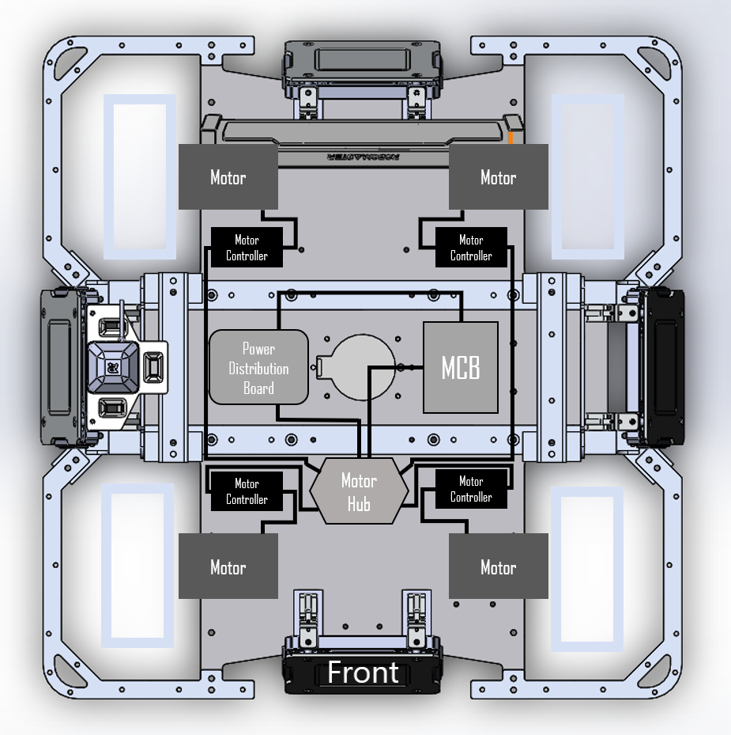
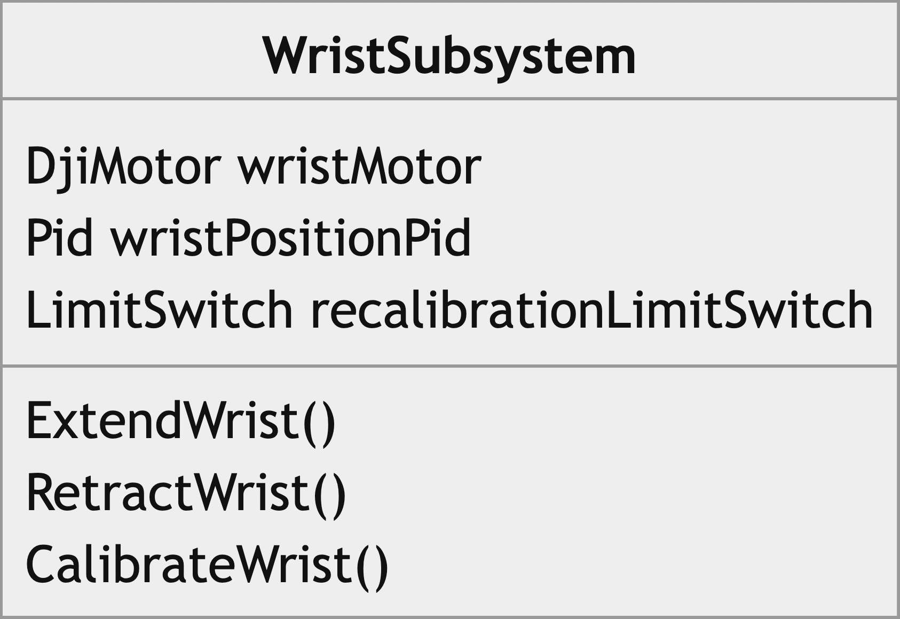
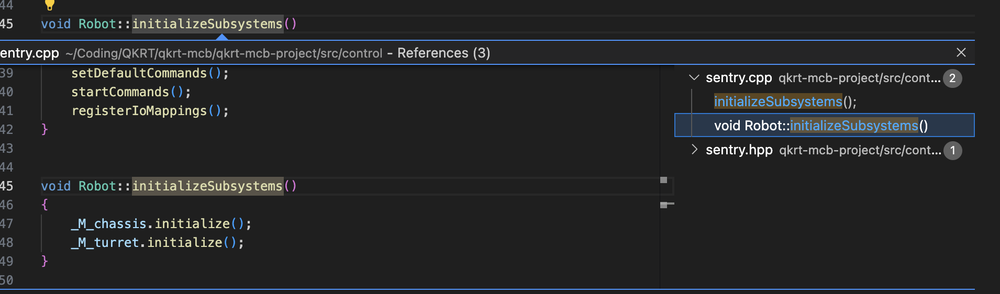

- [Introduction](#introduction)
  - [Getting the Starter Code](#getting-the-starter-code)
  - [Context of the Code Structure](#context-of-the-code-structure)
- [Tank Drive Tutorial](#tank-drive-tutorial)
  - [Hardware](#hardware)
  - [Code Architecture](#code-architecture)
    - [Subsystems](#subsystems)
    - [Commands](#commands)
  - [Installing the Development Environment](#installing-the-development-environment)
  - [Notes Before Beginning](#notes-before-beginning)
  - [Overview](#overview)
  - [Step 1: Control Operator Interface](#step-1-control-operator-interface)
    - [Declare Functions for Processing Remote Input](#declare-functions-for-processing-remote-input)
    - [Implement the Declared Functions](#implement-the-declared-functions)
  - [Step 2: ChassisSubsystem](#step-2-chassissubsystem)
    - [Implement Constructor and Initialize Members](#implement-constructor-and-initialize-members)
    - [Implement the `initialize` Function](#implement-the-initialize-function)
    - [Implement the `setVelocityTankDrive` Function](#implement-the-setvelocitytankdrive-function)
    - [Implement the `refresh` Function](#implement-the-refresh-function)
  - [Step 3: ChassisTankDriveCommand](#step-3-chassistankdrivecommand)
    - [Implement the Constructor and Initialize Members](#implement-the-constructor-and-initialize-members)
    - [Implement the `execute` Function](#implement-the-execute-function)
    - [Implement the `end` Function](#implement-the-end-function)
  - [Step 4: Robot](#step-4-robot)
    - [Declare `ChassisSubsystem` as a Private Member](#declarechassissubsystem-as-a-private-member)
    - [Declare `ChassisTankDriveCommand` as a Private Member](#declare-chassistankdrivecommand-as-a-private-member)
    - [Implement Constructor and Initialize Members](#implement-constructor-and-initialize-members-1)
    - [Finish Implementing the `initializeSubsystems` Function](#finish-implementing-the-initializesubsystems-function)
    - [Finish Implementing the `registerSoldierSubsystems` Function](#finish-implementing-the-registersoldiersubsystems-function)
    - [Finish Implementing the `setDefaultSoldierCommands` Function](#finish-implementing-the-setdefaultsoldiercommands-function)


# Introduction
In this meeting we will be walking through the entirety of the Tank Drive Tutorial provided by the University of Washington. This tutorial is highly relevant to us because both our codebase and the tutorial code rely on the Taproot framework also provided by the Univerisity of Washington.

This meeting is also an opportunity for you to ask questions related to C++. Feel free at any point during the meeting to raise your hand and ask a question.

By the end of the meeting, we will have a completed version of the Tank Drive Tutorial and I will prove that it works by demonstrating how to flash code onto our Sentry robot. Anyone who wants to drive the robot can do so.

Here are the resources relevant to the Tank Drive Tutorial:

- tutorial steps: [https://aruw.gitlab.io/controls/aruw-edu/tutorials/1_tank_drive.html](https://aruw.gitlab.io/controls/aruw-edu/tutorials/1_tank_drive.html#)
- starter code: [https://github.com/qkrt-rm/qkrt-tank-drive.git](https://github.com/qkrt-rm/qkrt-tank-drive.git)
- solutions: [https://gitlab.com/aruw/controls/aruw-edu/-/tree/solutions?ref_type=heads](https://gitlab.com/aruw/controls/aruw-edu/-/tree/solutions?ref_type=heads)

---

## Getting the Starter Code

<div style="padding: 1rem; background-color: #fff3cd; border: 1px solid #ffeaa7; border-radius: 4px; margin: 1rem 0;">
  <strong>⚠️ Disclaimer:</strong> The Tank Drive Tutorial project configuration is not set up for our robots. We will be covering what files and settings to change once we proceed to the flashing the code.
</div>

</aside>

If you have completed the steps from the last meeting, you should already have the starter code on your machine. Open a terminal and use the `cd` command to change your directory into the folder called tank-drive.

If you haven’t, open a terminal and change your working directory to some project folder (e.g. I keep my QKRT related projects in `~/dev/qkrt`). Use Git to recursively clone the Tank Drive Tutorial starter code onto your machine.

```bash
cd some/project/folder
git clone --recursive https://gitlab.com/aruw/controls/aruw-edu.git tank-drive
```

Change directory into tank-drive and open Visual Studio Code using the following commands:

```bash
cd tank-drive
code .
```

---

## Context of the Code Structure

This tutorial, as well as our codebase, relies on Taproot, a framework that facilitates command-based programming. it provides a structured approach to organizing robot control code by dividing it into discrete commands and subsystems, enhancing modularity and reusability


# Tank Drive Tutorial
## Hardware

The chassis is a fundamental subsystem for many RoboMaster robots. Our 2022
standard chassis consists of the following hardware:

- Main microcontroller. The
  [microcontroller](https://en.wikipedia.org/wiki/Microcontroller) used on the
  standard is the [RoboMaster type A Board (aka
  MCB)](https://gitlab.com/aruw/controls/taproot/-/wikis/Definitions#main-control-board-mcb). *(QRKT uses Type C)*
  The microcontroller has peripherals to interact with all other hardware
  subsystems including the chassis subsystem.
- Power distribution board (the RoboMaster [Power Management
  Module](https://www.robomaster.com/en-US/products/components/detail/1432) is
  used). This module provides power to all electronic systems on the robot,
  including the microcontroller and chassis motors.
- Four motor controllers ([RoboMaster C620 motor
  controllers](https://store.dji.com/product/rm-c620-brushless-dc-motor-speed-controller)).
  The motor controllers are wired to the microcontroller so the main
  microcontroller can send commands to the motor controllers using a protocol
  called
  [CAN](https://gitlab.com/aruw/controls/taproot/-/wikis/Definitions#controller-area-network-can).
  Furthermore, the motor controllers send motor information to the main
  microcontroller using the same protocol. This includes information such as the
  measured velocity of the motor and the motor shaft's rotational position. More
  information about the motor controller may be found in the [C620
  datasheet](https://rm-static.djicdn.com/tem/17348/RoboMaster%20C620%20Brushless%20DC%20Motor%20Speed%20Controller%20V1.01.pdf).
- Four motors ([RoboMaster M3508
  motors](https://www.robomaster.com/en-US/products/components/general/M3508)).
  Each motor is connected to the motor controller. The motor takes commands from
  the motor controller and sends information back to the motor controller. Each
  motor is connected to a [mecanum
  wheel](https://en.wikipedia.org/wiki/Mecanum_wheel).
- Remote control receiver. The [DR-16
  receiver](https://www.robomaster.com/en-US/products/components/detail/1837) is
  used to wirelessly receive remote control information from a paired
  [remote](https://gitlab.com/aruw/controls/taproot/-/wikis/Definitions#remote).

  

## Code Architecture

The robot we develop is complicated, so we attempt to keep our work sane by
using an architecture that we have developed previously that does some of the
tedious and more challenging operations for us. This curriculum focuses only on
learning the basics of using **subsystems** and **commands** (our high level
control architecture), as well as the **operator interface**, which interprets
remote and computer input and allows a user to control the robot. There is a lot
more that goes into controlling the robot that we will glaze over in this
tutorial.

Much of the subsystem and command framework developed previously was at a high
level based on FIRST programming. There is a good explanation of how subsystems
and commands work
[here](https://docs.wpilib.org/en/latest/docs/software/commandbased/what-is-command-based.html).
On this page, you should read the following sections:
- What Is "Command-Based" Programming?
- Subsystems and Commands
- How Commands Are Run

In addition, I recommend looking at the following pages:
- [Subsystems](https://docs.wpilib.org/en/latest/docs/software/commandbased/subsystems.html)
- [Commands](https://docs.wpilib.org/en/latest/docs/software/commandbased/commands.html)
- [The Command
  Scheduler](https://docs.wpilib.org/en/latest/docs/software/commandbased/command-scheduler.html)

Note though that while our code is not designed exactly like what is found in
FIRST, the ideas are similar. Our implementation of command groups, for example,
is very different.

For more information about our implementation of the command/subsystem
framework, see [this taproot wiki
page](https://gitlab.com/aruw/controls/taproot/-/wikis/Command-Subsystem-Framework).
Our implementation is not close to perfect, but hopefully you will be able to
improve it some time in the future!


### Subsystems

A subsystem is a core organizational unit that encapsulates a group of related inputs and/or outputs. Let’s use a wrist mechanism an an example of a subsystem. 

The `WristSubsystem` class contains code necessary for controlling the wrist motors. The API that the subsystem exposes is intended to describe the meaningful behaviors of the robot’s wrist component (i.e. think "open the claw", not "activate piston 4"). It is often the case that a single, externally-visible behavior of a subsystem is composed of many internal steps. This level of encapsulation allows us to easily modify and debug individual parts of the robot code without impacting other parts.

A class diagram showing the basic functionality of our example `WristSubsystem` class is shown below:



The top section of the diagram illustrates what this subsystem encapsulates (internal variables),
while the bottom section illustrates the public API (methods) that a wrist subsystem may have for a command to interact with.

### Commands

A command defines an action that the robot should perform. The idea is that command-based
programming should allow one writing a `Command` class to focus on what hardware should do instead of how. While the subsystem takes care of how a robot should accomplish some goal, at the command level, we only care about requesting that the robot do some task.

To interact with the robot, the command will request access to an "active" subsystem and tell it what to do. Building on the example of the `WristSubsystem` described in the above section, a command to "move the wrist to a grabbing position" would be responsible for calling the subsystem's `ExtendWrist()` function when appropriate.

Note that command instances are re-used: a single command could be initialized, run, finished, then later initialized again. Ensure that `initialize()` resets any state stored in the command!


## Installing the Development Environment

Before starting this tutorial, you must install the development environment.
Please refer to the README's ["New user
guide"](https://gitlab.com/aruw/controls/aruw-edu#new-user-guide) section to set
up aruw-edu.

Once you have installed aruw-edu, create a git branch on the repository with
some reasonable name. This is where you will be developing software for this
tutorial.

Reference [this Git
tutorial](https://gitlab.com/aruw/controls/taproot/-/wikis/Git-Tutorial) for
information about cloning, creating, and checking out a new branch if you are
unfamiliar with using Git.

## Notes Before Beginning

- This tutorial is not a comprehensive of C++ or the codebase. It is designed to
  guide your learning in a structured manner. As you go through this tutorial,
  it is expected that you work with others, ask leads questions about parts, and
  most importantly, search the internet for various questions that are not
  specific to the project. There is a plethora of information about C++ and C++
  tutorials you can refer to as you work through these tutorials.

- As you start working through this tutorial, **build your code often**. Refer
  to the ["Building and running via the
  terminal"](https://gitlab.com/aruw/controls/aruw-edu#building-and-running-via-the-terminal)
  section in aruw-edu's readme for more information about building the repo.
  This will help tremendously because it allows you to easily identify where
  errors are coming from. Unlike some IDEs, VSCode Intellisense is not always
  accurate and will sometimes not identify errors (especially more complex,
  annoying ones). So, please, please build often.

- The library that you will be using to develop your chassis tank drive software
  is called
  [taproot](https://gitlab.com/aruw/controls/taproot/-/wikis/definitions#taproot).
  Please look over the section called ["Code Generated in User
  Projects"](https://gitlab.com/aruw/controls/taproot/-/wikis/Code-Generation-in-User-Projects)
  in the taproot wiki. In aruw-edu, taproot is included as a git submodule at
  the top level of the repository. Generated taproot software that you will be
  interacting with is located in `./aruw-edu/aruw-edu-project/taproot`.

- If you are stuck on some part of this tutorial, please reach out for help.
  Solutions are available; however, these should not be referenced unless
  absolutely necessary. Doing so defeats the purpose of this tutorial.

- Various C++ tips that are not specific to our codebase will be in a "tip"
  block.

## Overview

During this project, you will be developing software in
`./aruw-edu/aruw-edu-project/src`. This wiki will guide you through finishing a
variety of incomplete subsystems and commands. Next is a description of each
section you will be developing.

- **`ControlOperatorInterface`**: Accesses inputs provided by a user from the
  [remote](https://gitlab.com/aruw/controls/taproot/-/wikis/definitions#remote).
  Provides an abstraction layer between remote input and user control used in
  commands (commands won't interact with the `Remote` object--rather they will
  call functions from the `ControlOperatorInterface` object). For example, the
  operator interface translates "move the left stick up and right stick down" to
  "I want to turn left".

- **`ChassisSubsystem`**: A subsystem that "owns" the four chassis drive motors.
  Interprets chassis movement directives sent by a command that is running and
  sends motor control commands to the motors. For example, a command will direct
  the chassis subsystem to move forward at 1 m/s. The subsystme will convert
  this directive into desired motor output commands for all four motors. 

- **`ChassisTankDriveCommand`**: Translates user input ("I want to turn left")
  into instructions that the `ChassisSubsystem` can understand.

- **`Robot`**: Where instances of the `ChassisSubsystem`,
  `ChassisTankDriveCommand`, and other control-related object instances are
  instantiated.


<div style="padding: 1rem; background-color: #fff3cd; border: 1px solid #ffeaa7; border-radius: 4px; margin: 1rem 0;"> 
<b>Tip:</b>
In C++, pointers, references, and variables are two very important
concepts that you must understand to successfully complete this tutorial.
Often, tutorials might state something like "pass variable X to function Y."
This statement in itself may be ambiguous, as the function may expect the 
variable to be passed as a pointer, reference, or raw variable. In order to
follow such an instruction, you must be able to understand how you are passing
variable X, be that as a reference, pointer, or variable. If you do not have
experience with C++ pointers, review [this slideshow](https://courses.cs.washington.edu/courses/cse333/20sp/lectures/03-c-pointers.pdf).
If you do not have experience with C++ references, review [this slideshow](https://courses.cs.washington.edu/courses/cse333/20sp/lectures/11-c++-refs-const-classes.pdf).
It is not expected that you are a master of pointers, references, and variables
before starting this tutorial, but it generally useful to have a base
understanding of how they work.

To test your understanding, answer the following questions:

  - Label `foo`, `bar`, and `baz` as pointers, references, or variables.
    ```cpp
    void function()
    {
      int foo{42};
      int *bar = &foo;
      int &baz = foo;
    }
    ```
    <details>
    <summary>Answer</summary>
      <code>foo</code>: variable<br>
      <code>bar</code>: pointer<br>
      <code>baz</code>: reference
    </details>

  - In the function `f1` defined below, how would you call `f2`, `f3`, and `f4`
    respectively, passing the variable `foo` to these three functions?
    ```cpp
    void f2(int var)
    {
      // Print var and address of var
      std::cout << var << ", " << &var << std::endl;
    }

    void f3(int *var)
    {
      // Print var and address of var
      std::cout << *var << ", " << var << std::endl;
    }

    void f4(int &var)
    {
      // Print var and address of var
      std::cout << var << ", " << &var << std::endl;
    }

    void f1()
    {
      int foo{42};
      // Now call f2, f3, and f4, passing foo to each.
    }
    ```
    <details>
    <summary>Answer</summary>
    <code>f2(foo)</code>, <code>f3(&foo)</code>, <code>f4(foo)</code>
    </details>

    Bonus question, will `f2`, `f3` and `f4` print identical values when the
    functions above are called from `f1()`?

    <details>
    <summary>Answer</summary>
    No, <code>f2</code> will print a different result compared to <code>f3</code> and <code>f4</code>. While <code>var</code>
    contains the same value in all three functions, the address of <code>var</code> is not the same in <code>f2</code>'s case since a copy of foo is
    being created for <code>f2</code> when you pass <code>foo</code> as a variable instead of a pointer
    or reference.
    </details>

    Assume `f1()` has now been changed to the following:
    ```cpp
    void f1()
    {
      int *foo = new int(42);
      // Now call f2, f3, and f4, passing foo to each
      delete foo;
    }
    ```
    How would you call `f2`, `f3`, and `f4` respectively, passing the variable
    `foo` to these three functions?

    <details>
    <summary>Answer</summary>
    <code>f2(*foo)</code>, <code>f3(foo)</code>, <code>f4(*foo)</code>
    </details>
</div>


## Step 1: Control Operator Interface

The control operator interface is an interface used to interpret remote and/or keyboard state values to be used by commands.

It is useful in cases where commands need to accept user input in addition to the scheduler's start/stop command mappings. A chassis command, for example, could be running continuously and then interact with the control operator interface to receive remote input to tell the chassis to move.

### Declare Functions for Processing Remote Input

Declare the functions `getChassisTankLeftInput` and `getChassisTankRightInput`. Both functions should be declared as public members of the `ControlOperatorInterface` class, not take any parameters, and return a `float`.

<div style="padding: 1rem; background-color: #fff3cd; border: 1px solid #ffeaa7; border-radius: 4px; margin: 1rem 0;">Tip:
Use F12 to go to the definitions in code.


</div>

```cpp
class ControlOperatorInterface
{
public:
    ControlOperatorInterface(tap::communication::serial::Remote &remote);

    /* your code here... */
    
    /* ================= */
private:
    tap::communication::serial::Remote &remote;
};
```

<details>
<summary>Click to show the solution</summary>

```cpp
class ControlOperatorInterface
{
public:
ControlOperatorInterface(tap::communication::serial::Remote &remote);

/* your code here... */
float getChassisTankLeftInput();

float getChassisTankRightInput();
/* ================= */
private:
tap::communication::serial::Remote &remote;
};
```
</details>

     

### Implement the Declared Functions

In the `Remote` class, there exists a member function called `Remote::getChannel` which takes a single argument of type`Remote::Channel`. You can view the full documentation [here](https://aruw.gitlab.io/controls/taproot/api/classtap_1_1communication_1_1serial_1_1_remote.html).

With that knowledge, use the `remote` class member to return the channel state of the left and right vertical channels of the remote.

```cpp
namespace control
{
ControlOperatorInterface::ControlOperatorInterface(Remote &remote)
				: remote(remote) {}

/* your code here... */

/* ================= */

}  // namespace control
```

<details>
<summary>Click to show the solution</summary>

```cpp
namespace control
{
ControlOperatorInterface::ControlOperatorInterface(Remote &remote)
				: remote(remote) {}

/* your code here... */
float ControlOperatorInterface::getChassisTankLeftInput()
{
		return remote.getChannel(Remote::Channel::LEFT_VERTICAL);
}

float ControlOperatorInterface::getChassisTankLeftInput()
{
		return remote.getChannel(Remote::Channel::RIGHT_VERTICAL);
}
/* ================= */

}  // namespace control
```
</details>

## Step 2: ChassisSubsystem

This class encapsulates the four chassis drive motors and controls them by interpreting chassis movement directives sent by a command. For example, the tank drive command we will be implementing in the next step will be able to direct the chassis subsystem to move the left and/or right wheels forward at 1 m/s. The subsystem will convert this directive into desired motor output commands for all four motors.

### Implement Constructor and Initialize Members

The most important parts of the `ChassisSubsystem` class are shown below:

```cpp
struct ChassisConfig
{
    tap::motor::MotorId leftFrontId;
    tap::motor::MotorId leftBackId;
    tap::motor::MotorId rightBackId;
    tap::motor::MotorId rightFrontId;
    tap::can::CanBus canBus;
    modm::Pid<float>::Parameter wheelVelocityPidConfig;
};

///
/// @brief This subsystem encapsulates four motors that control the chassis.
///
class ChassisSubsystem : public tap::control::Subsystem
{
public:
    /// @brief Motor ID to index into the velocityPid and motors object.
    enum class MotorId : uint8_t
    {
        LF = 0,  ///< Left front
        LB,      ///< Left back
        RF,      ///< Right front
        RB,      ///< Right back
        NUM_MOTORS,
    };
    
		/* ... */
		
		ChassisSubsystem(Drivers& drivers, const ChassisConfig& config);
		
		/* ... */
private:
		/* ... */

    /// Desired wheel output for each motor
    std::array<float, static_cast<uint8_t>(MotorId::NUM_MOTORS)> desiredOutput;

    /// PID controllers. Input desired wheel velocity, output desired motor current.
    std::array<Pid, static_cast<uint8_t>(MotorId::NUM_MOTORS)> pidControllers;

protected:
    /// Motors.
    std::array<Motor, static_cast<uint8_t>(MotorId::NUM_MOTORS)> motors;
};
```

> Note: each index of the member variables above correspond to information about a single wheel (i.e. `desiredOutput[i]`, `pidControllers[i]`, and `motors[i]` correspond to the desired output, pid controller, and motor of the `i`th wheel). When accessing information pertaining to a specific wheel, index using the `MotorId` enum class defined above like so:
> 
> 
> ```cpp
> // i = static_cast<uint8_t>(MotorId::LF)
> desiredOutput[static_cast<uint8_t>(MotorId::LF)] = 0.0f;
> ```
> 

Use an initializer list to call the base class constructor and initialize new member variables:

- Call the base class constructor, `tap::control::Subsystem`, passing the address of the `drivers` paramater as its only argument.
- For both `desiredOutput` and `pidControllers`, rely on `std::array`'s default constructor.
    - For primitive types, like `float`, the default constructor will initialize all elements to zero
    - For class types, like `Pid`, the default constructor will initialize each element using its default constructor (if one exists, otherwise an error will occur)
    
    You can call a member’s default constructor in an initializer list by using the following syntax:
    
    ```cpp
    Foo::Foo()
        : member{}  // call member's default constructor
    {
    }
    ```
    
- For `motors`, initialize each element by explicitly calling the `Motor` constructor for each wheel. The order in which you initialize each wheel should be as follows:
    
    ```cpp
    motors{
        Motor( ... ),  // left-front
        Motor( ... ),  // left-back
        Motor( ... ),  // right-back
        Motor( ... ),  // right-front
    }
    ```
    
    The signature for the `Motor` class constructor is shown below:
    
    ```cpp
    DjiMotor(Drivers* drivers,
             tap::motor::MotorId desMotorIdentifier,
             tap::can::CanBus motorCanBus,
             bool isInverted,
             const char* name,
             /* other params with default values... */);
    ```
    
    - Use the corresponding members of the `config` parameter to initialize each motor.
    - Do not invert any of the wheel motors
    - Name each motor  `"LF"`, `"LB"`, `"RB"`, `"RF"` (i.e. LF corresponds to left-front)

In the body of the constructor, call the `Pid::setParameter` member function for each element of the `pidControllers` array, passing `config.wheelVelocityPidConfig` as its only argument.

```cpp
namespace control::chassis
{

// STEP 1 (Tank Drive): create constructor

/* ==================================== */

/* ... */
}  // namespace control::chassis
```

> Solution
> 
> - Click arrow to show…
>     
>     ```cpp
>     namespace control::chassis
>     {
>     
>     // STEP 1 (Tank Drive): create constructor
>     ChassisSubsystem::ChassisSubsystem(Drivers& drivers,
>                                        const ChassisConfig& config)
>         : tap::control::Subsystem(&drivers),
>           desiredOutput{},
>           pidControllers{},
>           motors{
>               Motor(&drivers, config.leftFrontId, config.canBus, false, "LF"),
>               Motor(&drivers, config.leftBackId, config.canBus, false, "LB"),
>               Motor(&drivers, config.rightBackId, config.canBus, true, "RB"),
>               Motor(&drivers, config.rightFrontId, config.canBus, true, "RF"),
>           }
>     {
>         for (auto& controller : pidControllers)
>         {
>             controller.setParameter(config.wheelVelocityPidConfig);
>         }
>     }
>     /* ==================================== */
>     
>     /* ... */
>     }  // namespace control::chassis
>     ```
>     

### Implement the `initialize` Function

The declaration of the `initialize` function is shown below:

```cpp
class ChassisSubsystem : public tap::control::Subsystem
{
public:
		/* ... */
		
    ///
    /// @brief Initializes the drive motors.
    ///
    void initialize() override;

		/* ... */
};
```

The implementation of this function should call the`DjiMotor::initialize` member function for each element of the `motors` array.

```cpp

namespace control::chassis
{
/* ... */

// STEP 2 (Tank Drive): initialize function

/* ===================================== */

/* ... */
}  // namespace control::chassis

```

> Solution
> 
> - Click arrow to show…
>     
>     ```cpp
>     namespace control::chassis
>     {
>     /* ... */
>     
>     // STEP 2 (Tank Drive): initialize function
>     void ChassisSubsystem::initialize()
>     {
>         for (auto& motor : motors)
>         {
>             motor.initialize();
>         }
>     }
>     /* ===================================== */
>     
>     /* ... */
>     }  // namespace control::chassis
>     ```
>     

### Implement the `setVelocityTankDrive` Function

The declaration of `setVelocityTankDrive` and the definition of `mpsToRpm` is shown below:

```cpp
class ChassisSubsystem : public tap::control::Subsystem
{
public:
		/* ... */
		
    ///
    /// @brief Control the chassis using tank drive. Sets the wheel velocity of the four drive
    /// motors based on the input left/right desired velocity.
    ///
    /// @param left Desired chassis speed in m/s of the left side of the chassis. Positive speed is
    /// forward, negative is backwards.
    /// @param right Desired chassis speed in m/s of the right side of the chassis.
    ///
    mockable void setVelocityTankDrive(float left, float right);
    
		/* ... */
private:
    inline float mpsToRpm(float mps)
    {
        static constexpr float GEAR_RATIO = 19.0f;
        static constexpr float WHEEL_DIAMETER_M = 0.076f;
        static constexpr float WHEEL_CIRCUMFERANCE_M = M_PI * WHEEL_DIAMETER_M;
        static constexpr float SEC_PER_M = 60.0f;

        return (mps / WHEEL_CIRCUMFERANCE_M) * SEC_PER_M * GEAR_RATIO;
    }
    
    /* ... */
};

```

The implementation of this function should do the following:

- convert the parameters `left` and `right` from m/s to rev/min (rpm), and then clamp those values between `-MAX_WHEELSPEED_RPM` and `MAX_WHEELSPEED_RPM` using `limitVal`.
- Use the calculated wheel rpm’s to set the desired output of each wheel motor.

```cpp
namespace control::chassis
{
/* ... */

// STEP 3 (Tank Drive): setVelocityTankDrive function

/* =============================================== */

/* ... */
}  // namespace control::chassis
```

> Solution
> 
> - Click arrow to show…
>     
>     ```cpp
>     namespace control::chassis
>     {
>     /* ... */
>     
>     // STEP 3 (Tank Drive): setVelocityTankDrive function
>     void ChassisSubsystem::setVelocityTankDrive(float left, float right)
>     {
>         left = mpsToRpm(left);
>         right = mpsToRpm(right);
>     
>         left = limitVal(left, -MAX_WHEELSPEED_RPM, MAX_WHEELSPEED_RPM);
>         right = limitVal(right, -MAX_WHEELSPEED_RPM, MAX_WHEELSPEED_RPM);
>     
>         desiredOutput[static_cast<uint8_t>(MotorId::LF)] = left;
>         desiredOutput[static_cast<uint8_t>(MotorId::LB)] = left;
>         desiredOutput[static_cast<uint8_t>(MotorId::RB)] = right;
>         desiredOutput[static_cast<uint8_t>(MotorId::RF)] = right;
>     }
>     /* =============================================== */
>     
>     /* ... */
>     }  // namespace control::chassis
>     ```
>     

### Implement the `refresh` Function

The declaration of the `refresh` function is shown below:

```cpp
class ChassisSubsystem : public tap::control::Subsystem
{
public:
		/* ... */
		
    ///
    /// @brief Runs velocity PID controllers for the drive motors.
    ///
    void refresh() override;

		/* ... */
};
```

This function is called repeatedly at some specified frequency (500Hz in the tutorial code) and the implementation should do the following:

- For each motor in `motors`, call `Pid::update` from the motor’s corresponding controller in `pidControllers`.
    
    This function expects a `float` as input. The input should be the error (difference) between the desired rpm and the motor’s current rpm
    
    - The desired rpm for each wheel motor is accessible from `desiredOutput`.
    - The wheel motor’s current rpm is accessible by calling `Motor::getShaftRPM`.
    
    The `Pid::update` function will use this error to calculate what the motor’s desired output current should be. The output value is accessible by calling `Pid::getValue`.
    
- Set each motor’s desired output by calling `DjiMotor::setDesiredOutput` and passing the value calculated by the controller.

```cpp
namespace control::chassis
{
/* ... */

// STEP 4 (Tank Drive): refresh function

/* ================================== */

/* ... */
}  // namespace control::chassis
```

> Solution
> 
> - Click arrow to show…
>     
>     ```cpp
>     namespace control::chassis
>     {
>     /* ... */
>     
>     // STEP 4 (Tank Drive): refresh function
>     void ChassisSubsystem::refresh()
>     {
>         auto runPid = [](Pid &pid, Motor &motor, float desiredOutput) {
>             pid.update(desiredOutput - motor.getShaftRPM());
>             motor.setDesiredOutput(pid.getValue());
>         };
>     
>         for (size_t i = 0; i < motors.size(); i++)
>         {
>             runPid(pidControllers[i], motors[i], desiredOutput[i]);
>         }
>     }
>     /* ================================== */
>     
>     /* ... */
>     }  // namespace control::chassis
>     ```
>     

## Step 3: ChassisTankDriveCommand

Translates user input (from the `ControlOperatorInterface`) into instructions that the `ChassisSubsystem` class can understand.

### Implement the Constructor and Initialize Members

The most important parts of the `ChassisSubsystem` class are shown below:

```cpp
class ChassisTankDriveCommand : public tap::control::Command
{
public:
		/* ... */
		
    /**
     * @brief Construct a new Chassis Tank Drive Command object
     *
     * @param chassis Chassis to control.
     */
    ChassisTankDriveCommand(ChassisSubsystem &chassis,
												    ControlOperatorInterface &operatorInterface);
		
		/* ... */
private:
    ChassisSubsystem &chassis;
		
    ControlOperatorInterface &operatorInterface;
};
```

Use an initializer list and initialize the member variables `chassis` and `operatorInterface` using the corresponding parameters.

In the body of the constructor, call `addSubsystemRequirement` defined in the base class and pass the address of `chassis` as its only argument.

```cpp
namespace control::chassis
{

// STEP 1 (Tank Drive): Constructor

/* ============================= */

/* ... */
}  // namespace control::chassis
```

> Solution
> 
> - Click arrow to show…
>     
>     ```cpp
>     namespace control::chassis
>     {
>     
>     // STEP 1 (Tank Drive): Constructor
>     ChassisTankDriveCommand::ChassisTankDriveCommand(
>     					ChassisSubsystem &chassis,
>     					ControlOperatorInterface &operatorInterface)
>         : chassis(chassis),
>           operatorInterface(operatorInterface)
>     {
>         addSubsystemRequirement(&chassis);
>     }
>     /* ============================= */
>     
>     /* ... */
>     }  // namespace control::chassis
>     ```
>     

### Implement the `execute` Function

The declaration of the `execute` function is shown below:

```cpp
class ChassisTankDriveCommand : public tap::control::Command
{
public:
		/* ... */
		
		void execute() override;
		
		/* ... */
};
```

In this function, we will define our instructions (movement directives) to the chassis subsystem that we implemented in the last step.

The implementation of this function should do the follow:

- Get the input values reported by:
    - `ControlOperatorInterface::getChassisTankLeftInput`
    - `ControlOperatorInterface::getChassisTankRightInput`
    
    These functions return values along the interval [`-1.0f`, `1.0f`]. Scale them to map them along the interval [`-MAX_CHASSIS_SPEED_MPS`, `MAX_CHASSIS_SPEED_MPS`]
    
- Call the `ChassisSubsystem::setVelocityTankDrive` function, passing the scaled velocity values as its arguments.

```cpp
namespace control::chassis
{
/* ... */

// STEP 2 (Tank Drive): execute function

/* ================================== */

/* ... */
}  // namespace control::chassis
```

> Solution
> 
> - Click arrow to show…
>     
>     ```cpp
>     namespace control::chassis
>     {
>     /* ... */
>     
>     // STEP 2 (Tank Drive): execute function
>     void ChassisTankDriveCommand::execute()
>     {
>         float left = operatorInterface.getChassisTankLeftInput();
>         float right = operatorInterface.getChassisTankRightInput();
>     
>         left = left * MAX_CHASSIS_SPEED_MPS;
>         right = right * MAX_CHASSIS_SPEED_MPS;
>     
>         chassis.setVelocityTankDrive(left, right);
>     }
>     /* ================================== */
>     
>     /* ... */
>     }  // namespace control::chassis
>     ```
>     

### Implement the `end` Function

The declaration of the `end` function is shown below:

```cpp
class ChassisTankDriveCommand : public tap::control::Command
{
public:
		/* ... */
		
		void end(bool interrupted) override;
		
		/* ... */
};
```

The implementation of this function should set the chassis’s desired velocty to zero for both sides of the chassis.

```cpp
namespace control::chassis
{
/* ... */

// STEP 3 (Tank Drive): end function

/* ============================== */

}  // namespace control::chassis
```

> Solution
> 
> - Click arrow to show…
>     
>     ```cpp
>     namespace control::chassis
>     {
>     /* ... */
>     
>     // STEP 3 (Tank Drive): end function
>     void ChassisTankDriveCommand::end(bool /* interrupted */)
>     {
>         chassis.setVelocityTankDrive(0, 0);
>     }
>     /* ============================== */
>     
>     }  // namespace control::chassis
>     ```
>     

## Step 4: Robot

The `Robot` class is designed to be a singleton, meaning that there should only exist a single instance of this object throughout the entire duration of the program.

Below is the header file for the `Robot` class. It may not look like your conventional header file, but for good reason. Different robots require different parameters, so robot.hpp acts as a generic header file, leveraging preprocessor derectives to choose which robot source files to target.

```cpp
#pragma once

#if defined(TARGET_STANDARD)
#include "standard.hpp"
#else
#error "standard only robot supported"
#endif
```

In the case of this tutorial, we are only supporting the “standard” robot, which doesn’t mean anything to us right now but is important to know later.

### Declare `ChassisSubsystem` as a Private Member

Note: the `ChassisSubsystem` class is declared in the `chassis` namespace.

```cpp
class Robot
{
public:
    Robot(Drivers &drivers);
    
    /* ... */
private:
    /* ... */

    // STEP 1 (Tank Drive): declare ChassisSubystem
    
    /* ========================================= */

    /* ... */
};
```

### Declare `ChassisTankDriveCommand` as a Private Member

Note: the `ChassisTankDriveCommand` class is declared in the `chassis` namespace.

```cpp
class Robot
{
public:
    Robot(Drivers &drivers);
    
    /* ... */
private:
    /* ... */
    
    // STEP 2 (Tank Drive): declare ChassisTankDriveCommand
    
    /* ================================================= */
};
```

### Implement Constructor and Initialize Members

The most important parts of the `Robot` class are shown below, including the new private member declarations:

```cpp
/* ... */
namespace control
{

class Robot
{
public:
    Robot(Drivers &drivers);
    
    /* ... */
private:
    /* ... */
    
    chassis::ChassisSubsystem chassis;
    
    chassis::ChassisTankDriveCommand chassisTankDrive;
};

}  // namespace control
```

Use an initializer list and initialize the member variables `chassis` and `chassisTankDrive` like so:

- first, initialize `chassis` by passing `drivers` as its first argument, and construct a new `chassis::ChassisConifig` object as its second argument. Below is an example of how you can construct an inline `struct` object in an initializer list.
    
    
    ```cpp
    struct Foo
    {
        int a;
        int b;
    };
    
    ```
    
    ```cpp
    class Bar
    {
    public:
        Bar()
            : foo(Foo{
                  .a = 1,  // note the dot operator (.)
                  .b = 2
              })
        {
        }
    private:
        Foo foo;
    };
    ```
    
    Here is how the chassis should be configured to work for our robots:
    
    - `.leftFrontId` = `MotorId::Motor1`
    - `.leftBackId` = `MotorId::Motor2`
    - `.rightBackId` = `MotorId::Motor3`
    - `.rightFrontId` = `MotorId::Motor4`
    - `.canBus` = `CanBus::CAN_BUS1`
    - `.wheelVelocityPidConfig` = `modm::Pid<float>::Parameter(10, 0, 0, 0, 16'000)`
- Initialize `chassisTankDrive` by passing `chassis` and `drivers.controlOperatorInterface` as its arguments.

```cpp
namespace control
{
Robot::Robot(Drivers &drivers) : drivers(drivers),  // add this comma
// STEP 3 (Tank Drive): construct ChassisSubsystem and ChassisTankDriveCommand

/* ======================================================================== */
{
}

/* ... */
}  // namespace contol
```

> Solution
> 
> - Click arrow to show…
>     
>     ```cpp
>     namespace control
>     {
>     Robot::Robot(Drivers &drivers) : drivers(drivers),
>     // STEP 3 (Tank Drive): construct ChassisSubsystem and ChassisTankDriveCommand
>           chassis(
>               drivers,
>               chassis::ChassisConfig{
>                   .leftFrontId  = MotorId::MOTOR1,
>                   .leftBackId   = MotorId::MOTOR2,
>                   .rightBackId  = MotorId::MOTOR3,
>                   .rightFrontId = MotorId::MOTOR4,
>                   .canBus = CanBus::CAN_BUS1,
>                   .wheelVelocityPidConfig
>                           = modm::Pid<float>::Parameter(10, 0, 0, 0, 16'000),
>               }
>           ),
>           chassisTankDrive(chassis, drivers.controlOperatorInterface)
>     /* ======================================================================== */
>     {
>     }
>     
>     /* ... */
>     }  // namespace contol
>     ```
>     

### Finish Implementing the `initializeSubsystems` Function

Below is the given implementation of `initializeSubsystems`. To finish the implementation, you must manually initialize `chassis` by calling its `ChassisSubsystem::initialize` function.

```cpp
void Robot::initializeSubsystems()
{
    // STEP 4 (Tank Drive): initialize declared ChassisSubsystem
    
    /* ====================================================== */
}
```

> Solution
> 
> - Click arrow to show…
>     
>     ```cpp
>     void Robot::initializeSubsystems()
>     {
>         // STEP 4 (Tank Drive): initialize declared ChassisSubsystem
>         chassis.initialize();
>         /* ====================================================== */
>     }
>     ```
>     

### Finish Implementing the `registerSoldierSubsystems` Function

Subsystems that should be managed by the command scheduler must be registered with it during runtime. Our chassis subsystem is an example of one of those subsystems.

Below is the given implementation of `registerSoldierSubsystems`. To finish the implementation, access the command scheduler via `drivers` and call `CommandScheduler::registerSubsystem`, passing the address of `chassis` as its only argument

```cpp
void Robot::registerSoldierSubsystems()
{
    // STEP 5 (Tank Drive): register declared ChassisSubsystem
    
    /* ==================================================== */
}
```

> Solution
> 
> - Click arrow to show…
>     
>     ```cpp
>     void Robot::registerSoldierSubsystems()
>     {
>         // STEP 5 (Tank Drive): register declared ChassisSubsystem
>         drivers.commandScheduler.registerSubsystem(&chassis);
>         /* ==================================================== */
>     }
>     ```
>     

### Finish Implementing the `setDefaultSoldierCommands` Function

We want `chassisTankDrive` to be a default command of `chassis`. This way, the command scheduler will execute the tank drive command whenever no other commands that depend on chassis subsystem are running (so for now, all the time).

Below is the given implementation of `setDefaultSoldierCommands`. To finish the implementation, call `ChassisSubsystem::setDefaultCommand`, passing the address of `chassisTankDrive` as its only argument.

```cpp
void Robot::setDefaultSoldierCommands()
{
    // STEP 6 (Tank Drive): set ChassisTankDriveCommand as default command for ChassisSubsystem
    
    /* ====================================================================================== */
}
```

> Solution
> 
> - Click arrow to show…
>     
>     ```cpp
>     void Robot::setDefaultSoldierCommands()
>     {
>         // STEP 6 (Tank Drive): set ChassisTankDriveCommand as default command for ChassisSubsystem
>         chassis.setDefaultCommand(&chassisTankDrive);
>         /* ====================================================================================== */
>     }
>     ```
>     
